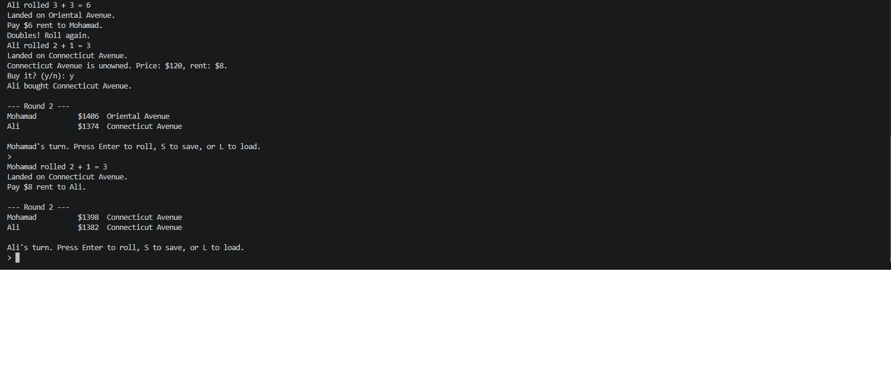

# Mini Monopoly (Java)

A two to four player console Monopoly game. Chance and Community Chest are omitted.

## Run in VS Code

1. Open the `java` folder in VS Code with the Java Extension Pack installed.
2. Open `MonopolyGame.java` and run it, or use the terminal:

```sh
cd java
javac *.java
java MonopolyGame
```

## Rules included

- Players start with $1,500 and move clockwise by rolling two six-sided dice.
- Passing GO pays $200.
- Unowned properties may be bought; landing on another player's property charges rent.
- Doubles grant another roll. A third consecutive double sends the player directly to jail for $50 without passing GO.
- Landing on Go To Jail sends the player to jail and charges $50.
- Income Tax and Luxury Tax are charged when landed on.
- When a player's money reaches $0 or less, they are out and their properties return to unowned. The last player active wins.
- At the turn prompt, press `S` to save or `L` to load `monopoly-save.dat`.

## Classes

- `Property`: name, purchase price, rent, and owner.
- `Player`: name, money, board location, and active status.
- `Board`: spaces, players, movement, GO bonus, jail, and property ownership.
- `GameState`: serializable board and turn information.
- `MonopolyGame`: console interface, turn rules, and save/load.

## Repository URL

[https://github.com/mchoucair/MonopolyProject](https://github.com/mchoucair/MonopolyProject)

## Screenshot

